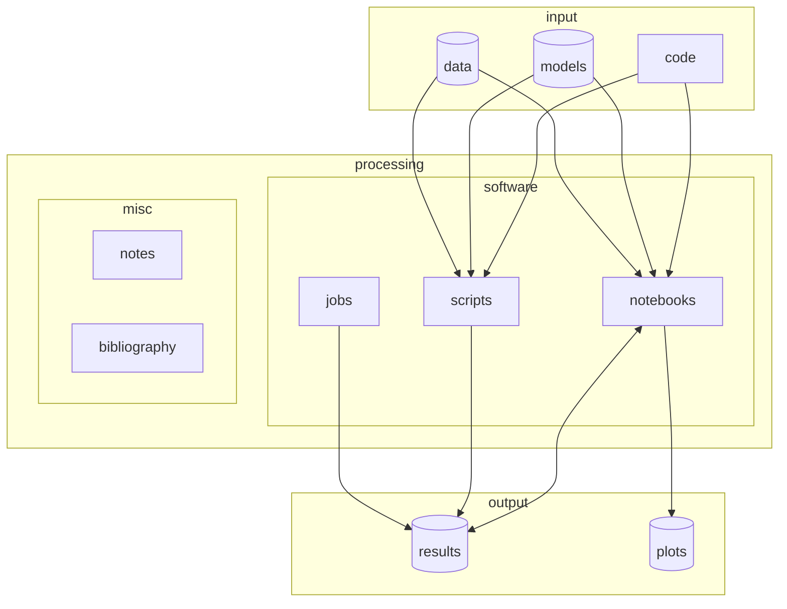

# template-project

Custom template project as a base for project repositories.
<a href="https://github.com/new?template_name=template-project&template_owner=RiccardoBuscicchio">
  
</a>


## Useful links

Collaborators: 
* riccardo.buscicchio@unimib.it
* myaddress@myprovider.com

# Typical workflow

In this **`README.md`** file we document the typical working tree for a small scale project.

Having a tree structure defined in advance saves a lot of time and headaches down the line. Spend five minutes now familiarizing with the structure, you'll save hours later. Here I propose a structure tested over time that fits into most situations I've encountered so far.
The folders and files below follow closely the workflow represented below:



* **`environment.yml`**: a file to ensure reproducibility of the working python environment
* **`./code`**: typically, we share some code, more or less tested (this is where the project core code should be).
* **`./data`**: typically, the code requires some input data (e.g. upstream analyses results, proprietary data, etc).
* **`./models`**: typically, we need to define a number of different models (e.g. parameters) while developing our analysis. It's good to keep the parameters stored as machine-readable and human-readable objects: `json`, `yaml`, `hdf5`, `dill`. You can pick whichever you prefer, better if there are input/output libraries available and documented for Python. The fewer formats you use across the project, the easier it is for others to do the same.
* **`./notebooks`**: typically, we tend to develop code through `./jupyter` (i.e. a fancy, lightweight, browser-based working environment for Python) or `./mathematica`  notebooks, as it's easy to look through them, run them, fix them. Once we trust a piece of code under development, it can be migrated into the `./code`. This two step process is my typical workflow, and it would be nice if you use it when collaborating with me, too.
* **`./notes`**: typically, we tend to share short notes (e.g. mathematical derivations, proofs, back-of-the envelopes calculations), logging our discussion and research process. _Markdown_, _LateX_, _Plain text_, or any digital note-taking format are all good choices. Always prefer source-code (e.g. tex) over compiled files (i.e. pdf), to avoid repository useless bloating.
* **`./scripts`**: we need some place to dump recurrent scripts, external scripts we re-use over time, recycled from previous projects (e.g. plotting stuff, as in the example `figures.py`).
* **`./results`**: the code produces some output, as data products.
* **`./plots`**: typically, we inspect and publish our data products results as plots. It's good to keep the result production from the plot production separate, especially when aiming for a publication, or a thesis.
* **`./jobs`**: typically, the code might be run on high-performance cluster with different standards for `./jobs` submission files (e.g. slurms, condor). It's good to keep the job submission files stored for future reproducibility. Most of the time clusters produce `./logs` of the computing activity, useful to monitor the job status and outcome.
* **`refs.bib`**: a place to store useful references for the project

Never trust your procedural memory (i.e. remembering the exact sequence of actions to obtain a result): in 9 months time it will be gone. So document what you do within reason.

# Template tree structure

```bash
.
├── code
│   └── file.py
├── data
├── environment.yml
├── jobs
│   └── logs
├── LICENSE
├── models
├── notebooks
│   ├── jupyter
│   └── mathematica
├── notes
├── plots
├── README.md
├── refs.bib
├── results
└── scripts
    └── figures.py

```
